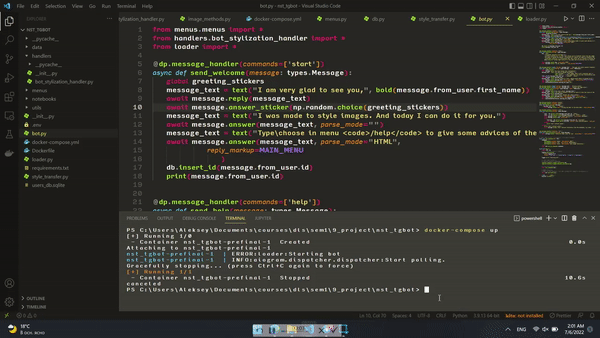

# Neural Style Transfer Asynchronized Telegram Bot with DataBase

* [Decription](#step1)
* [Setup](#step2)
* [Setup (Docker)](#step3)
* [Usage](#step4)
* [Features](#step5)


<a name = "step1"></a>

# Description

Asynchronized telegram bot with database to make style transfer between two photos. Bot includes three types of transfer (two pretrained: Picasso and Van Gogh images  and one slow method). You can upload two photos with different extensions and types (image/document), specify which is content and which is style image and get the ouput of the model.



<a name = "step2"></a>
# Setup
1. Open cmd (Win+R)
2. Clone the repository ([or download](https://github.com/addicted-by/nst_bot/archive/refs/heads/main.zip))
```
git clone https://github.com/addicted-by/nst_bot/
```
3. Create `.env` file with your telegram token
```python
TELEGRAM_TOKEN = "YOUR TOKEN" 
```
4. Install requirements
```
pip install -r requirements.txt
```
5. Run the code
```
python bot.py
```

<a name = "step3"></a>
# Alternative (Docker)
4. Docker Compose
```
docker-compose up
```

<a name = "step4"></a>
# Usage


<a name = "step5"></a>
# Features
### Stack:
---
Backend: aiogram

Database: sqlite

Neural network: PyTorch

Train dataset: coco dataset

